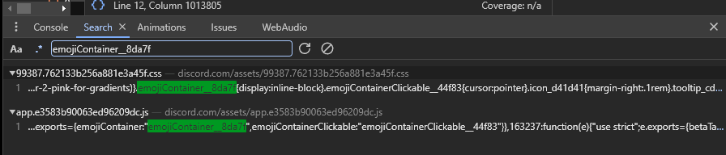
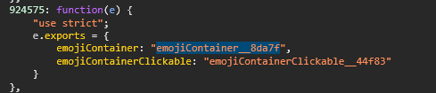

# AutoCSS

AutoCSS is a tool designed to facilitate Discord mod theme development by enabling developers to generate CSS classes based on props. 
Active Development progress will commence shortly.

## Usage

To utilize AutoCSS, follow these steps:

1. Install NodeJS
[Download Here](https://nodejs.org/en/download)

2. Install pnpm
```javascript
npx pnpm i -g pnpm@latest
```

3. Install dependencies:
```javascript
pnpm i
```
4. Execute with given file.
```javascript
 npx ts-node index.ts <fileName> (.css | optional)
    
 // Our system will automatically apply .css 
 // The file needs to be in the same dir of the project
```

# Template
This is how the .css file should be structured for full functionality

```css
.['sizeLarge'].sizeLarge 
{
  display: none;
}
```

Don't worry! you can still have files like this
```css

.['sizeLarge'].sizeLarge
{
  display: none;
}

.mentioned__58017 .contents_f41bb2 > .messageContent__21e69{
    background: linear-gradient(90deg,var(--colour-1),var(--colour-2),var(--colour-3),var(--colour-4));;
    border-radius: 8px;
    z-index: 2;
    margin-left: 0px;
    padding-left: 0px;
    width: calc(100% + 48px);
}
```

# But wait... 
You are probably asking yourself, 'how do I find the classNames?'

It's really simple. For Theme Developers usually you use inspect element.
Click on an element and get the className.

But there's a catch. This system is finding props like a modder would.
```javascript
// BetterDiscord
BdApi.Webpack.getByKeys('sizeLarge').sizeLarge

// Replugged
replugged.webpack.getByProps('sizeLarge').sizeLarge

// Vencord
findByPropsLazy('sizeLarge').sizeLarge
```

How AutoCSS works is like this, you pass in some props and it works, but 
sometimes you'll have to add more props to find your className
Let's say we want `emojiContainer__8da7f` but we really get `emojiContainer__31342`

That's where we add `['emojiContainer','emojiContainerClickable']` instead of
`['emojiContainer']`

The way you search for these is by search discords source to find what you want.

If I want `emojiContainer__8da7f` Open console, `CTRL + SHIFT + F`, Search for `emojiContainer__8da7f`
It should hopefully look something like this.



Click on the `.js` file



And there you go! There is your props to search for!

For a example plugin my beloved made (Pastel Love)
```css
:root {
    --colour-1: rgba(0,0,255,.2); /*base value: rgba(0,0,255,.2). Change the .2 to change the opacity.*/
    --colour-2: rgba(0,255,0,.2); /*base value: rgba(0,255,0,.2)*/
    --colour-3: rgba(255,255,0,.2); /*base value: rgba(255,255,0,.2)*/
    --colour-4: rgba(255,0,0,.2); /*base value: rgba(255,0,0,.2)*/
}

.["quotedChatMessage"].mentioned .["appLauncherOnboardingCommandName"].contents > .["appLauncherOnboardingCommandName"].messageContent {
   background: linear-gradient(90deg,var(--colour-1),var(--colour-2),var(--colour-3),var(--colour-4));;
   border-radius: 8px;
   z-index: 2;
   margin-left: 0px;
   padding-left: 0px;
   width: calc(100% + 48px);
}
.["quotedChatMessage"].message.["quotedChatMessage"].mentioned.["quotedChatMessage"].selected, .mouse-mode.full-motion .["quotedChatMessage"].mentioned:hover, ["quotedChatMessage"].mentioned {background: transparent!important;}
```
Gets converted to this!
```css
:root {
    --colour-1: rgba(0,0,255,.2); /*base value: rgba(0,0,255,.2). Change the .2 to change the opacity.*/
    --colour-2: rgba(0,255,0,.2); /*base value: rgba(0,255,0,.2)*/
    --colour-3: rgba(255,255,0,.2); /*base value: rgba(255,255,0,.2)*/
    --colour-4: rgba(255,0,0,.2); /*base value: rgba(255,0,0,.2)*/
}
.mentioned_fa6fd2 .contents_d3ae0d > .messageContent_abea64 {
    background: linear-gradient(90deg,var(--colour-1),var(--colour-2),var(--colour-3),var(--colour-4));
    border-radius: 8px;
    z-index: 2;
    margin-left: 0px;
    padding-left: 0px;
    width: calc(100% + 48px);
}
.message_ccca67.mentioned_fa6fd2.selected_e3bc5d, .mouse-mode.full-motion .mentioned_fa6fd2:hover, mentioned_fa6fd2 {background: transparent!important;}
```

# Errors

1. ENOENT Error:
   if you get the error below
   ```javascript
      npm ERR! enoent ENOENT: no such file or directory,
   ```
   Run `npm install -g npm`, then run the `npx ts-node index.ts fileName<.css | optional>` command again 


Hopefully this makes css developers not have to remake their themes each time discord
rerolls classNames.
